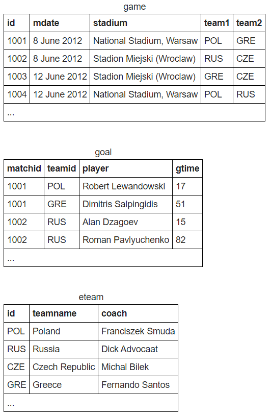
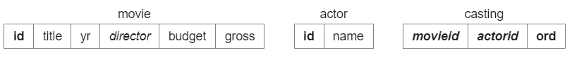
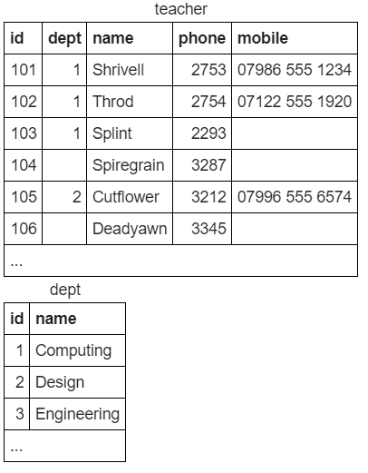

## SQL-Zoo

> This project is the provision of answers to the SQL Zoo Tutorials 0 - 9 Exercises

The exercises can be found [here](http://sqlzoo.net/wiki/Main_Page)

The `sql_zoo.sql` file is divided into the tutorial sub-headings:

- SELECT basics

- SELECT from World

- SELECT from Nobel

- SELECT within SELECT

- SUM and COUNT

- JOIN
>

- More JOIN
> 

- Using NULL
> 

